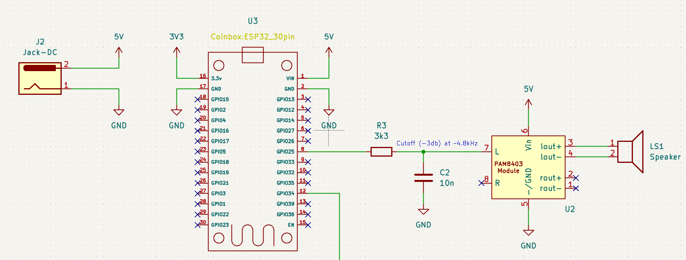
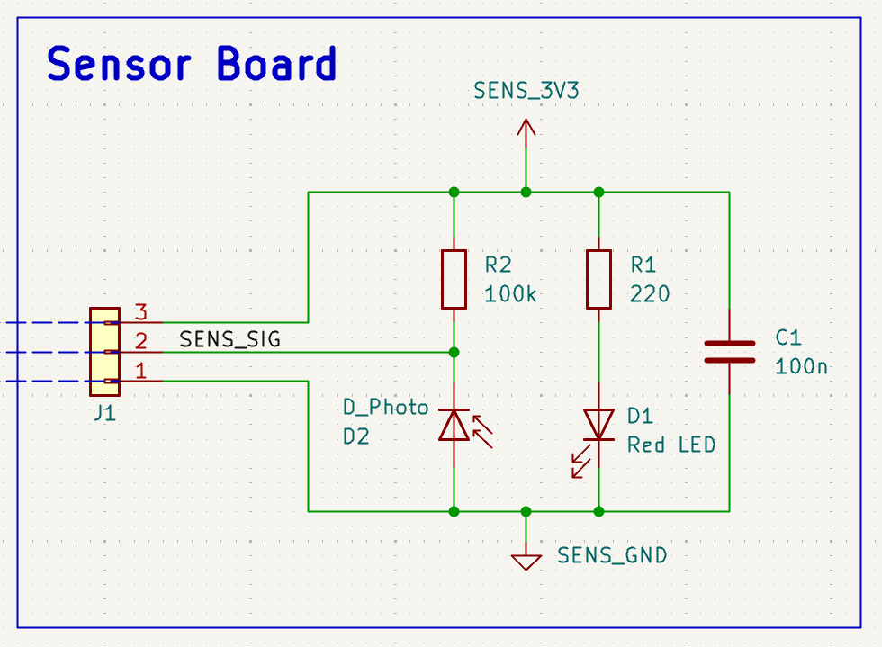

# Hardware Documentation

The coinbox hardware is rather simple, consisting of two main components: the main board and the sensor board.

## Main board

The main board carries the ESP32 dev board, the PAM8403 amplifier module, and a simple low‑pass filter.  
It takes in 5 V power and provides connections to the sensor board and speaker. The ESP32 handles both sensor
data processing and audio playback through its DAC. Note that not all ESP32 variants include a DAC
(for example, the ESP32‑C3 does not). The PAM8403 amplifier drives the 4 Ω / 3 W speaker, while the low‑pass filter
reduces high‑frequency noise from the DAC output. Since the ESP32’s DAC is not optimized for audio,
the raw playback quality is limited.

## Sensor board

The sensor board is very simple: it consists of a red LED and a photodiode.  
An IR LED with a matching photodiode would generally be more suitable, but we used what was available in the workshop.  
The LED is powered continuously, while the photodiode is placed in series with a resistor to form a voltage divider.  
The divider’s midpoint provides an output voltage that is read by the ESP32’s ADC. 

The principle is straightforward: the more light the photodiode receives, the more current flows through it,  
and the lower the output voltage becomes. With the coinbox closed, only little light reaches the photodiode,  
resulting in a relatively high voltage. When a coin passes through the slit, the LED’s light is reflected off the coin  
and onto the photodiode, causing the measured voltage to drop sharply. This change is used to detect coins.  

While this describes the basic principle of coin detection, it should be noted that the ESP32 applies additional filtering and signal processing
to the raw sensor signal to make it more robust against noise and false positives. These steps are explained in more detail in the software documentation.