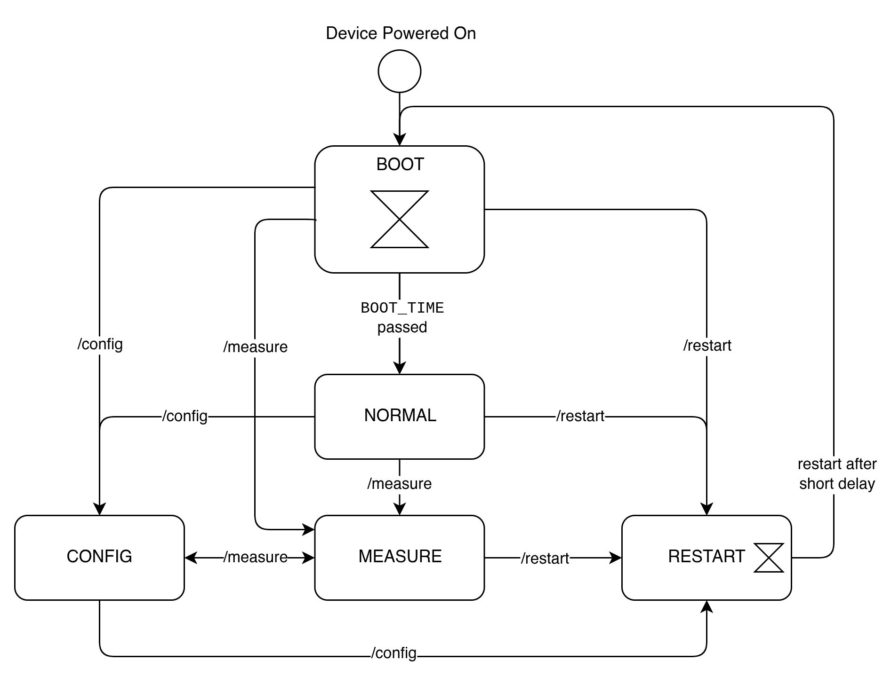

# Software Documentation

This chapter provides a brief overview of the software used in the Coinbox. Due to the primitive nature of the hardware, its fair to say that the software does most of the heavy lifting.

## Device Modes

The Coinbox has a total five modes of operation:

| **Mode**    | **Trigger**          | **Description**                                                                                                                                                   |
| ----------- | -------------------- | ----------------------------------------------------------------------------------------------------------------------------------------------------------------- |
| **Boot**    | Device startup       | Device waits briefly, allowing entry into Config mode. After the timeout, it switches to Normal mode.                                                             |
| **Normal**  | After Boot completes | Default operation: waits for coin insertions. On the first coin, Wi‑Fi is disabled to avoid interference, and a sound is played. Wi‑Fi remains off until restart. |
| **Config**  | `/config` endpoint   | Coin detection is disabled. Sounds can be uploaded safely and OTA updates can be performed. To exit, the device must be restarted.                                |
| **Measure** | `/measure` endpoint  | Streams ADC data via serial and UDP. Sounds can still be played, but Wi‑Fi stays on (degraded audio quality). Used for sensor and signal processing calibration.  |
| **Restart** | `/restart` endpoint  | Finishes pending tasks, then restarts the device.                                                                                                                 |

These modes along with their triggers are illustrated in the following state diagram:

Note that the Config, Measure, and Restart mode can be entered from Normal mode. However, once a coin has been inserted, Wi‑Fi is disabled and these endpoints are no longer available. In practice, this means you must switch to Config mode before inserting a coin. The Boot mode exists to guarantee a short time window during startup where Config mode can always be entered. This is especially useful if the device would otherwise immediately detect a coin due to a faulty sensor or misconfigured signal‑processing parameters.

## Coin Detection

A simple sensor consising of a red led and a photodiode is used to detect coin insertions. Once a coin is inserted, the light of the red led reflects and is picked up by the photodiode. This causes a noticable drop in voltage accross the photdiode which is measured by the ESP's ADC. The exact hardware of the sensor is further described in the [Hardware Documentation](docs/hardware.md), this section will focus on the software side of things.

Before diving into the exact logic of coin detection, some basic things are applied to the measured signal:

### ADC 